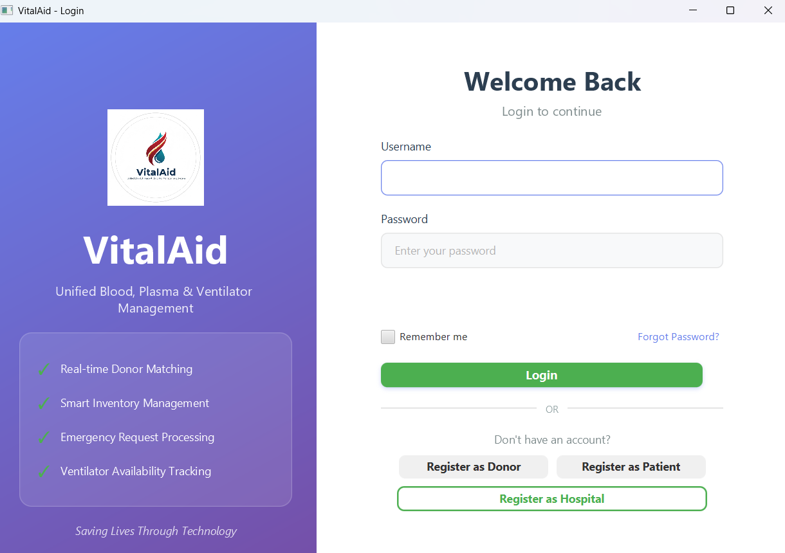
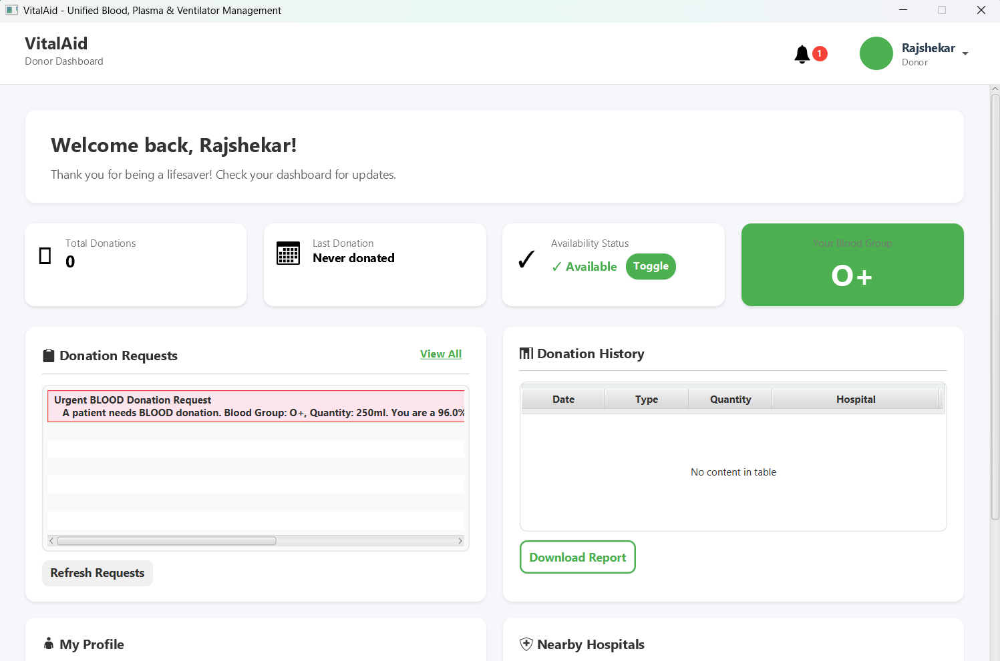
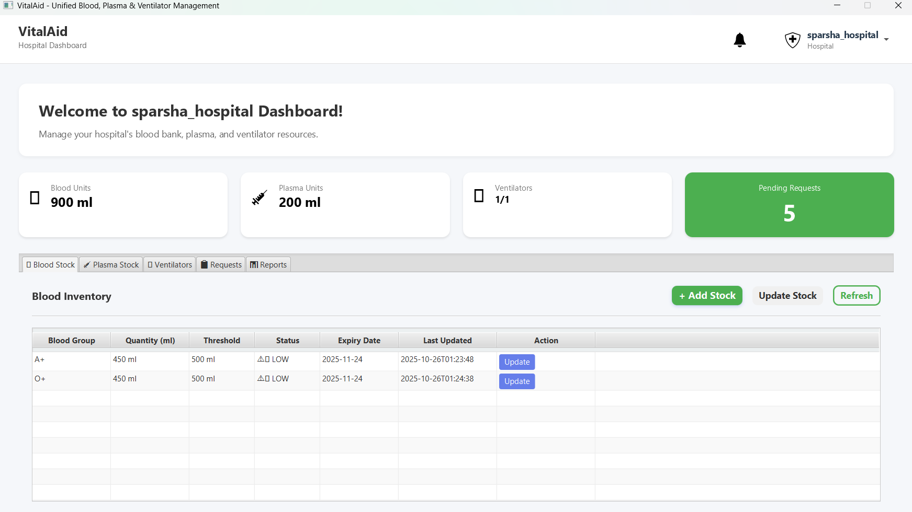
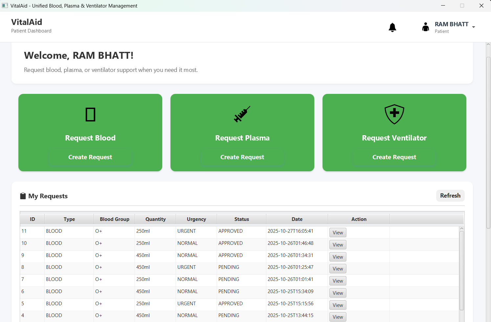
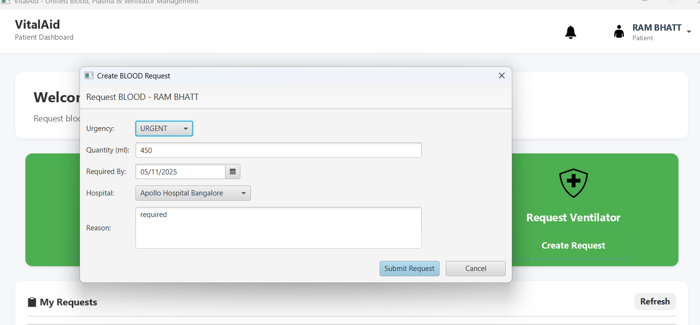

# 🏥 VitalAid: Unified Blood, Plasma & Ventilator Management System

VitalAid is a centralized healthcare resource management system designed to coordinate **blood, plasma, and ventilator availability** during medical emergencies. The system connects **donors, hospitals, and patients** through a unified real-time platform to reduce response delays and improve resource allocation.

This project was developed as a Mini Project under VTU for the academic year 2025–26.

---

## 🚑 Problem Statement
Hospitals and patients often face delays in accessing critical medical resources due to:
- Lack of centralized resource management
- Manual coordination processes
- Inefficient donor matching
- Inventory visibility issues
- Slow emergency communication

VitalAid solves these challenges through automation and real-time coordination.

---

## 💡 Key Features
- Donor registration and management
- Hospital inventory management
- Blood & plasma availability tracking
- Ventilator allocation management
- Emergency request processing
- Automated donor matching
- Real-time notifications (Email/SMS)
- Role-based dashboards (Donor, Patient, Hospital, Admin)
- Secure authentication system
- Scalable architecture for future expansion

---

## 🛠 Technology Stack
- **Language:** Java
- **UI Framework:** JavaFX
- **Database:** MySQL
- **Connectivity:** JDBC
- **Architecture:** MVC + DAO
- **Notifications:** Email/SMS APIs
- **Tools:** NetBeans IDE

---

## 🏗 System Architecture
The system follows a modular architecture:

JavaFX GUI
↓
Java Backend Services
↓
MySQL Database

Modules include:
- Authentication
- Donor Matching Engine
- Inventory Management
- Request Handling
- Notification Service

---

## 👥 User Roles
1. Donor
2. Patient
3. Hospital
4. Admin

Each role has its own dashboard and access permissions.

---
---

## 📸 Screenshots

### Login Page


### Donor Dashboard


### Hospital Dashboard


### Patient Dashboard


### Request Management


---

## ⚙️ Installation & Setup

### 1. Clone Repository
```bash
git clone https://github.com/Vinayreddy765/vitalaid-healthcare-management-system.git

2. Database Setup

Create MySQL database:

CREATE DATABASE vitalaid;


Import database/schema.sql.

3. Configure Database

Update database credentials in:

DatabaseConfig.java

4. Run Application

Open project in NetBeans and run:

VitalAidApp.java

📊 Impact

Reduces emergency response delay

Improves hospital resource coordination

Enables faster donor matching

Optimizes healthcare resource usage

🚀 Future Enhancements

Google Maps hospital locator

Mobile application

Predictive resource demand analytics

Report export and analytics dashboard

